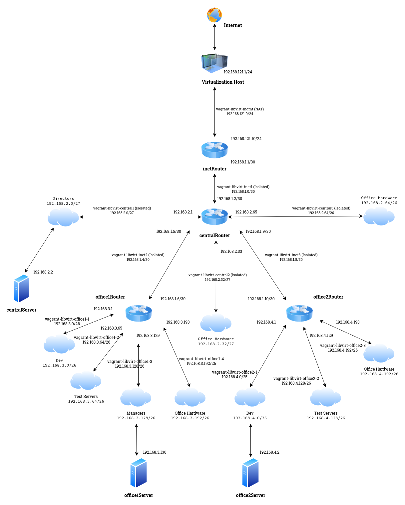
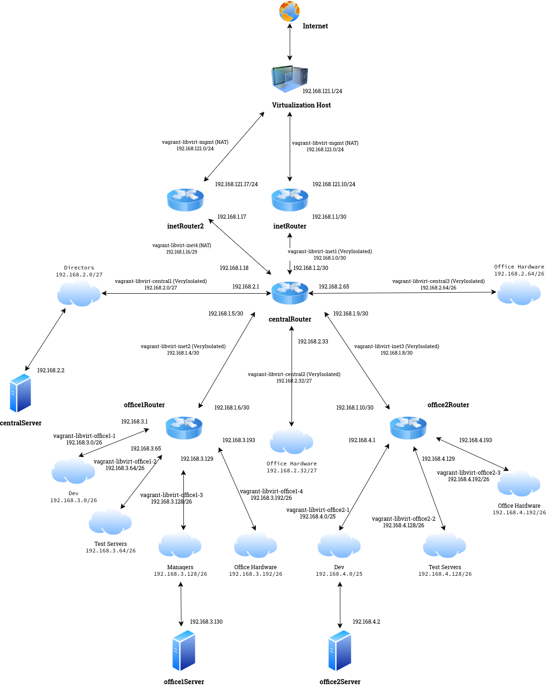

#### Настройка _Iptables_ в операционной системе Debian Bookworm
##### Описание стенда
Для работы будем использовать виртуальный офис, который был развёрнут в предыдущей статье [Архитектура сетей](https://github.com/spanishairman/networksdebian). 
Сама схема выглядит следующим образом:


##### Port Knocking
На хосте _inetRouter_ создадим правила фильтации сетевых пакетов так, чтобы с хоста _centralRouter_ можно было попасть на хост _inetRouter_ 
только с помощью технологии _Port Knocking_
> [!NOTE]
> _Port Knocking_ — это скрытый метод внешнего открытия портов, которые по умолчанию брандмауэр держит закрытыми. 
> Он работает, требуя попыток подключения к серии предопределенных закрытых портов. При простом методе port knocking, 
> когда получена правильная последовательность портовых «стуков» (попыток подключения), 
> брандмауэр открывает определенный порт(ы), чтобы разрешить подключение.
[Источник](https://wiki.archlinux.org/title/Port_knocking)

За реализацию _Port Knocking_ в нашем [Vagrantfile](Vagrantfile) отвечает следующий блок правил:
```
      # Политика по умолчанию для цепочки INPUT - DROP
      iptables -P INPUT DROP
      # Политика по умолчанию для цепочки OUTPUT - DROP
      iptables -P OUTPUT DROP
      # Политика по умолчанию для цепочки FORWARD - DROP
      iptables -P FORWARD DROP
      # Создаём пользовательскую цепочку KNOCKING.
      iptables -N KNOCKING
      # Базовый набор правил: разрешаем локалхост, запрещаем доступ к адресу сети обратной петли не от локалхоста, разрешаем входящие пакеты со статусом установленного сонединения.
      iptables -A INPUT -i lo -j ACCEPT
      iptables -A INPUT ! -i lo -d 127.0.0.0/8 -j REJECT
      iptables -A INPUT -m state --state ESTABLISHED,RELATED -j ACCEPT
      # Разрешим транзит трафика.
      iptables -A FORWARD -j ACCEPT
      # Открываем исходящие
      iptables -A OUTPUT -j ACCEPT
      # NAT
      iptables -t nat -A POSTROUTING ! -d 192.168.0.0/16 -o ens5 -j MASQUERADE
      # Разрешим входящие с хоста управления.
      iptables -A INPUT -s 192.168.121.1 -j ACCEPT
      # Также, разрешим входящие для всех хостов, кроме centralRouter
      iptables -A INPUT ! -s 192.168.1.2 -p tcp -m tcp --dport 22 -j ACCEPT
      # Откроем ICMP ping
      iptables -A INPUT -p icmp -m icmp --icmp-type 8 -j ACCEPT
      # Все входящие соединения, которые ранее не попали ни под одно правило, отправляем в таблицу KNOCKING.
      iptables -A INPUT -j KNOCKING
      # Если IP-адрес источника находится в списке knockfinal (но не более, чем 60 сек.), то пропустить его
      iptables -A KNOCKING -m state --state NEW -p tcp -m tcp --dport 22 -m recent --rcheck --seconds 60 --reap --name knockfinal -j ACCEPT
      # Если IP-адрес источника не находится ни в одном списке и первый порт для аутентификации верный, отбросить пакет и добавить источник в список knock1
      iptables -A KNOCKING -p tcp -m tcp --dport 1111 -m recent --set --name knock1 -j DROP
      # Если IP-адрес источника находится в списке knock1 (но не более 10сек) и второй порт для аутентификации верен, то отбросить пакет и добавить источник в список knock2
      iptables -A KNOCKING -p tcp -m recent --rcheck --seconds 10 --reap --name knock1 -m tcp --dport 2222 -m recent --set --name knock2 -j DROP
      # Если IP-адрес источника находится в списке knock2 (но не более 10сек) и третий порт для аутентификации верен, то отбросить пакет и добавить источник в список knock3
      iptables -A KNOCKING -p tcp -m recent --rcheck --seconds 10 --reap --name knock2 -m tcp --dport 3333 -m recent --set --name knock3 -j DROP
      # Если IP-адрес источника находится в списке knock3 (но не более 10сек) и четвёртый порт для аутентификации верен, то отбросить пакет и добавить источник в список knockfinal
      iptables -A KNOCKING -p tcp -m recent --rcheck --seconds 10 --reap --name knock3 -m tcp --dport 4444 -m recent --set --name knockfinal -j DROP
      # Всё, что не соответствует ни одному из ранее описаных правил, отбрасывается
      iptables -A KNOCKING -j DROP
```
Приведённые правила находятся в секции _provision_ виртуальной машины _inetRouter_

Теперь, для того, чтобы "постучаться" на хост _inetRouter_, создадим на хосте _centralRouter_ файл сценария, использующий для перебора портов сетевой сканер _nmap_:
```
      echo '#!/bin/bash' > /home/vagrant/knock.sh
      echo 'HOST="$1"' >> /home/vagrant/knock.sh
      echo 'shift' >> /home/vagrant/knock.sh
      echo 'for ARG in "$@"' >> /home/vagrant/knock.sh
      echo 'do' >> /home/vagrant/knock.sh
      echo '        nmap -Pn --host-timeout 100 --max-retries 0 -p "$ARG" "$HOST"' >> /home/vagrant/knock.sh
      echo 'done' >> /home/vagrant/knock.sh
      chown vagrant:vagrant /home/vagrant/knock.sh
      chmod u+x /home/vagrant/knock.sh
```

Проверим работоспособность созданных правил, для этого зайдём на хост centralRouter и запустим наш скрипт _knock.sh_:
```
max@localhost:~/vagrant/vg3> vagrant ssh Debian12-centralRouter 
==> Debian12-centralRouter: You assigned a static IP ending in ".1" to this machine.
==> Debian12-centralRouter: This is very often used by the router and can cause the
==> Debian12-centralRouter: network to not work properly. If the network doesn't work
==> Debian12-centralRouter: properly, try changing this IP.
Linux centralrouter 6.1.0-25-amd64 #1 SMP PREEMPT_DYNAMIC Debian 6.1.106-3 (2024-08-26) x86_64

The programs included with the Debian GNU/Linux system are free software;
the exact distribution terms for each program are described in the
individual files in /usr/share/doc/*/copyright.

Debian GNU/Linux comes with ABSOLUTELY NO WARRANTY, to the extent
permitted by applicable law.
Last login: Mon Sep 30 11:45:32 2024
vagrant@centralrouter:~$ ./knock.sh 192.168.1.1 1111 2222 3333 4444 && ssh 192.168.1.1
Starting Nmap 7.93 ( https://nmap.org ) at 2024-10-12 21:15 MSK
Warning: 192.168.1.1 giving up on port because retransmission cap hit (0).
Nmap scan report for 192.168.1.1
Host is up.

PORT     STATE    SERVICE
1111/tcp filtered lmsocialserver

Nmap done: 1 IP address (1 host up) scanned in 1.08 seconds
Starting Nmap 7.93 ( https://nmap.org ) at 2024-10-12 21:15 MSK
Warning: 192.168.1.1 giving up on port because retransmission cap hit (0).
Nmap scan report for 192.168.1.1
Host is up.

PORT     STATE    SERVICE
2222/tcp filtered EtherNetIP-1

Nmap done: 1 IP address (1 host up) scanned in 1.06 seconds
Starting Nmap 7.93 ( https://nmap.org ) at 2024-10-12 21:15 MSK
Warning: 192.168.1.1 giving up on port because retransmission cap hit (0).
Nmap scan report for 192.168.1.1
Host is up.

PORT     STATE    SERVICE
3333/tcp filtered dec-notes

Nmap done: 1 IP address (1 host up) scanned in 1.07 seconds
Starting Nmap 7.93 ( https://nmap.org ) at 2024-10-12 21:15 MSK
Warning: 192.168.1.1 giving up on port because retransmission cap hit (0).
Nmap scan report for 192.168.1.1
Host is up.

PORT     STATE    SERVICE
4444/tcp filtered krb524

Nmap done: 1 IP address (1 host up) scanned in 1.07 seconds
The authenticity of host '192.168.1.1 (192.168.1.1)' can't be established.
ED25519 key fingerprint is SHA256:K8TLHMOPXAMq3B3U+8/xYC0CMIlxm/7Cg43eYVLhqEQ.
This host key is known by the following other names/addresses:
    ~/.ssh/known_hosts:1: [hashed name]
Are you sure you want to continue connecting (yes/no/[fingerprint])? yes
Warning: Permanently added '192.168.1.1' (ED25519) to the list of known hosts.
vagrant@192.168.1.1's password: 
Linux inetrouter 6.1.0-25-amd64 #1 SMP PREEMPT_DYNAMIC Debian 6.1.106-3 (2024-08-26) x86_64

The programs included with the Debian GNU/Linux system are free software;
the exact distribution terms for each program are described in the
individual files in /usr/share/doc/*/copyright.

Debian GNU/Linux comes with ABSOLUTELY NO WARRANTY, to the extent
permitted by applicable law.
Last login: Mon Sep 30 11:45:32 2024
vagrant@inetrouter:~$
```

При попытке подключения "в лоб" получим отказ по таймауту:
```
vagrant@centralrouter:~$ ssh 192.168.1.1
ssh: connect to host 192.168.1.1 port 22: Connection timed out
```
##### Проброс портов
Для выполнения этого задания, добавим в нашу схему ещё один виртуальный хост _inetRouter2_ и настроим на нём все необходимые правила. Схема сети в данном случае будет выглядить так:



На виртуальном хосте _centralServer_ установим и запустим _Nginx_ и пробросим его порт _80_ на виртуальный хост _inetRouter2_ на порту _8080_, для этого создадим следующие
правила на _inetRouter2_:
```
      iptables -t nat -A PREROUTING -p tcp --dport 8080 -j DNAT --to-destination 192.168.2.2:80
      iptables -t nat -A POSTROUTING -j MASQUERADE
      netfilter-persistent save
```
Проверим доступность _Nginx_ с помощью утилиты _wget_, запущенной с хоста виртуалзации:
```
max@localhost:~/vagrant/vg3> wget http://192.168.1.17:8080
--2024-10-12 22:40:29--  http://192.168.1.17:8080/
Подключение к 192.168.1.17:8080... соединение установлено.
HTTP-запрос отправлен. Ожидание ответа… 200 OK
Длина: 615 [text/html]
Сохранение в: «index.html»

index.html                                      100%[======================================================================================================>]     615  --.-KB/s    за 0s      

2024-10-12 22:40:29 (40,0 MB/s) - «index.html» сохранён [615/615]
```
> [!NOTE]
> К данной работе прилагаю также запись консоли. Для того, чтобы воспроизвести выполненные действия,
> необходимо скачать файлы [screenrecord-2024-10-12.script](screenrecord-2024-10-12.script) и [screenrecord-2024-10-12.time](screenrecord-2024-10-12.time),
> после чего выполнить в каталоге с загруженными файлами команду:

```
scriptreplay ./screenrecord-2024-10-12.time ./screenrecord-2024-10-12.script
```
Спасибо за прочтение! :potted_plant:
